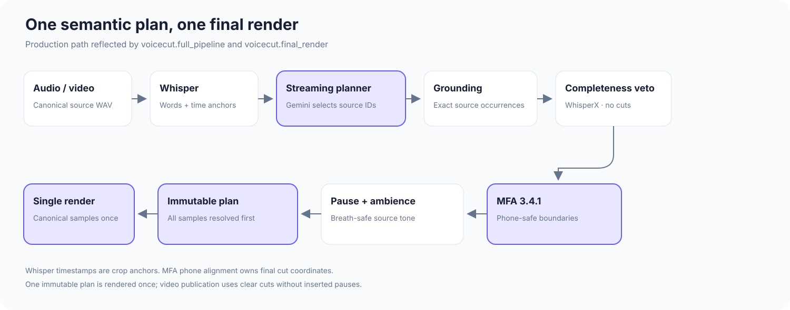

# VoiceCut — automatic narration editing for content creators

[](LICENSE)
[](pyproject.toml)
[](#requirements)
[](#requirements)

VoiceCut turns retake-heavy narration into a clean audio or video edit with one
command. It finds false starts, repeated takes, corrections, and recording
directions, then keeps the intended source occurrences and joins them at
phone-safe boundaries. VoiceCut never synthesizes replacement speech and
renders audio once from the canonical source WAV before media publication.

The project is in beta and currently targets narrated, single-speaker
recordings on Apple Silicon Macs.

## Examples

[Play the original and edited English audio, Russian audio, and video on the
VoiceCut demo page.](https://vectozavr.github.io/voicecut/)

## Quick start

### Requirements

- Apple Silicon Mac running macOS
- Python 3.11 or 3.12
- Homebrew
- English or Russian single-speaker narration

The installer sets up FFmpeg, MLX Whisper, Montreal Forced Aligner 3.4.1, and
the isolated runtimes used by VoiceCut:

```bash
git clone https://github.com/vectozavr/voicecut.git
cd voicecut
./scripts/install.sh
source .venv/bin/activate
```

Add the API key for your selected cloud planner to `.env`. Gemini is the
default:

```dotenv
GEMINI_API_KEY=your_key_here
```

Then run VoiceCut with only the input file:

```bash
voicecut recording.wav
```

The result is written beside the input as `recording_edited.wav`. VoiceCut
keeps a supported input container by default and accepts common formats via
FFmpeg, including WAV, MP3, M4A, FLAC, MOV, and MP4. Uncommon audio containers
default to WAV; recognized video inputs default to MP4 when needed.

Useful variants:

```bash
# Choose the output path.
voicecut recording.mp3 -o final.mp3

# Edit Russian narration.
voicecut recording_ru.wav --language ru

# Edit video from its speech track.
voicecut presentation.mp4 -o presentation_cut.mp4

# Keep reusable diagnostics and stage metadata.
voicecut recording.wav --work-dir voicecut_work --debug-artifacts
```

An existing output is never overwritten unless `--overwrite` is supplied.
See the [installation guide](docs/installation.md) for first-run model
downloads and manual setup.

## How it works



1. **Build one source transcript.** MLX Whisper produces timestamped source
   words; English can add narrowly gated hidden-retry evidence. Whisper
   timestamps are crop anchors, not final edit coordinates.
2. **Select the intended take.** The planner receives transcript words and
   occurrence IDs, then returns exactly which source occurrences belong in the
   narration.
3. **Validate the selection.** Source grounding prevents unsupported words,
   while WhisperX is used only to veto incomplete retained word occurrences.
4. **Resolve physical cuts.** Montreal Forced Aligner maps the actual source
   words to phones. Final cut coordinates cannot enter retained phones.
5. **Freeze and render once.** One immutable boundary plan is built before any
   output samples are written. Audio is sliced directly from the canonical
   source; video follows the same intervals with direct picture cuts.

For English, Respiro-en breath replacement is enabled by default and operates
only inside MFA-confirmed non-speech using verified clean ambience copied from
the same recording. It cannot alter retained phone samples; disable it with
`--breath-cleanup off`. Russian defaults to breath cleanup off because
Respiro-en has not been validated for Russian.

Read the [architecture guide](docs/architecture.md) for the boundary-safety
invariants and artifact flow.

## Why VoiceCut is different

- **Semantic editing, not silence trimming.** It can distinguish a corrected
  take from a fluent but abandoned attempt.
- **Source-grounded decisions.** Every retained phrase maps back to exact word
  occurrences in the recording.
- **Phone-safe joins.** MFA phone alignment—not approximate Whisper word
  timestamps—owns production cut coordinates.
- **One boundary plan, one render.** Retained speech is not repeatedly cut,
  faded, and re-rendered by sequential cleanup stages.
- **Audio and video.** The same narration decision can publish a common audio
  format or a directly cut video.
- **Inspectable output.** A persistent work directory contains the transcript,
  semantic plan, alignment evidence, final boundary plan, and run summary.

## Planner backends

Cloud planners receive transcript text, source IDs, canonical thought context,
and—during acoustic repair—text-only boundary diagnostics. They never receive
the source audio or video. Transcription, alignment, boundary resolution, and
rendering stay local.

| Backend | Default model | Credential | Status |
| --- | --- | --- | --- |
| Gemini | `gemini-3.6-flash` | `GEMINI_API_KEY` | Recommended |
| OpenAI | `gpt-5-mini` | `OPENAI_API_KEY` | Supported |
| DeepSeek | `deepseek-v4-flash` | `DEEPSEEK_API_KEY` | Supported |
| Qwen / Gemma / custom MLX-LM | configurable local model | none | Experimental |

Select a backend or model explicitly when needed:

```bash
voicecut recording.wav --planner-backend openai
voicecut recording.wav --planner-backend gemini --planner-model gemini-3.6-flash
voicecut recording.wav --planner-backend gemma \
  --planner-model mlx-community/gemma-3-12b-it-4bit
```

Local planners are available for evaluation but are not yet the recommended
production path. See [configuration](docs/configuration.md) for every backend,
environment variable, and advanced option.

## Reliability and graceful degradation

VoiceCut validates planner JSON, source grounding, retained-word completeness,
MFA word/phone mapping, and final boundary safety. Long recordings are planned
in chronological windows with one-thought look-ahead. When a segment cannot be
safely edited after bounded retries, VoiceCut first widens or preserves local
source context and records a structured warning. If no safe plan remains, it
fails closed rather than guessing a coordinate or falsely publishing the full
unedited source as a successful edit.

Optional breath cleanup is best-effort: detector failure preserves the valid
MFA edit and its original pause content.

## Current limitations

- macOS on Apple Silicon is the supported platform today.
- VoiceCut is designed for one main narrator, not overlapping conversation or
  multi-camera visual editing.
- English and Russian are supported; language selection is explicit.
- Video is edited from speech timing only. VoiceCut does not understand visual
  continuity, slides, gestures, or camera changes.
- LLM planning is probabilistic and may occasionally select the wrong take.
- MFA phone alignment can occasionally place a cut slightly too early or late,
  especially around acronyms, technical terms, or tightly connected speech.
  Review every final export before publication.
- Local Qwen/Gemma planning remains experimental.
- The first run downloads several model assets and can take time.

## Documentation

| Guide | Contents |
| --- | --- |
| [Installation](docs/installation.md) | Supported setup, first-run downloads, and manual installation |
| [Examples](examples/README.md) | Exact commands, media files, and reproduction workflow |
| [Architecture](docs/architecture.md) | Production call graph, safety invariants, and manifests |
| [Configuration](docs/configuration.md) | Planner backends, languages, caching, and CLI options |
| [Troubleshooting](docs/troubleshooting.md) | Installation, model, long-recording, and media errors |
| [Contributing](CONTRIBUTING.md) | Development environment, tests, and contribution scope |
| [Credits](docs/credits.md) | Upstream projects, models, and licenses |

## Development

```bash
.venv/bin/python -m pytest -q
ruff check src tests
ruff format --check src tests
```

VoiceCut's tests use small fixtures and mocked external model responses; they
do not download MFA or Respiro-en during normal CI-style runs.

## Built with

VoiceCut builds on
[MLX Whisper](https://github.com/ml-explore/mlx-examples/tree/main/whisper),
[WhisperX](https://github.com/m-bain/whisperX),
[Montreal Forced Aligner](https://montreal-forced-aligner.readthedocs.io/),
[Respiro-en](https://github.com/ydqmkkx/Respiro-en),
[Silero VAD](https://github.com/snakers4/silero-vad), and
[FFmpeg](https://ffmpeg.org/), together with the selected planner provider.
See [credits and licensing details](docs/credits.md).

## Star history

[](https://github.com/vectozavr/voicecut)

## License

VoiceCut is released under the [MIT License](LICENSE). Third-party models and
components retain their own licenses; see [docs/credits.md](docs/credits.md).
