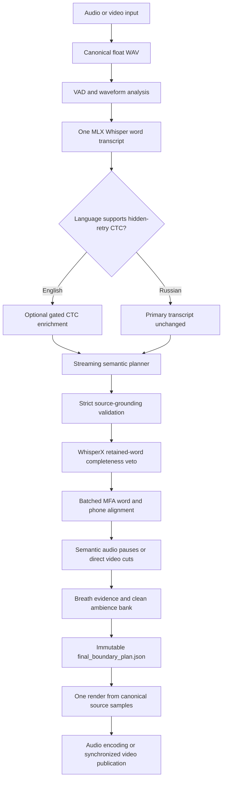

# Architecture

VoiceCut is a source-grounded narration editor. It identifies which spoken
attempts should remain, proves that their boundaries are acoustically usable,
and copies the selected samples from the original recording. It does not
synthesize replacement words or repeatedly process a chain of rendered WAVs.

This document describes the current production call graph. For user-facing
options, see [Configuration](configuration.md). For installation, see
[Installation](installation.md).

## Core invariants

The production design is built around four invariants:

1. **The semantic planner selects source occurrences, not sample coordinates.**
2. **MFA phone alignment is the sole authority for final production cut
   coordinates.** Whisper timestamps are crop anchors only.
3. **Every boundary is finalized before rendering begins.** Later code cannot
   move it.
4. **The canonical source WAV is rendered once.** No production renderer
   consumes audio written by an earlier renderer.

Retained speech remains sample-identical to the canonical source. Samples that
do not come from retained speech must be traceable to verified clean ambience
copied from that same source recording.

## Production flow

The cloud or local language model participates in semantic source selection
and, for audio, pause classification. Acoustic coordinates, waveform analysis,
and media processing remain local.

## 1. Media preparation

FFprobe inspects streams rather than trusting a filename extension. VoiceCut
selects the real audio stream, identifies whether the source includes video,
and records source metadata.

FFmpeg decodes the selected track into a lossless internal float PCM WAV. This
is the canonical source signal used by transcription, alignment, evidence
analysis, and the final renderer. It is not normalized, denoised, mastered, or
otherwise altered before analysis.

For video, the original video remains available for later picture extraction;
the canonical WAV is its speech-analysis track.

## 2. Speech-region analysis

Silero VAD and deterministic waveform features divide long recordings into
manageable speech regions. These regions improve processing and checkpointing,
but they are not sentences, semantic thoughts, or edit boundaries.

Silence and noise-only regions are represented explicitly. A later semantic or
acoustic component cannot infer that a VAD boundary is a safe word cut.

## 3. One primary word transcript

MLX Whisper produces one chronological transcript. Every word occurrence has
an immutable ID and approximate start/end times. Repeated words retain distinct
IDs, allowing the semantic planner to choose the later successful occurrence
rather than an identical-looking earlier attempt.

Whisper supplies:

- lexical evidence for semantic planning;
- chronological word identities;
- approximate anchors used to build generous local alignment crops.

Whisper does **not** supply final sample coordinates.

## 4. Language-specific transcript evidence

VoiceCut supports English and Russian through immutable language profiles.

### English

An optional gated CTC pass searches suspicious transcript geometry for spoken
restart words that a sequence-to-sequence ASR model may have normalized away.
It adds only supported source occurrences. If the optional worker is missing or
one crop fails, VoiceCut records degraded evidence and continues with the
validated primary Whisper transcript.

### Russian

The hidden-retry CTC implementation is not validated for Russian. Russian runs
therefore use the primary Whisper transcript directly and record an explicit
language-policy skip instead of fabricating English CTC evidence.

The remaining semantic, grounding, completeness, MFA, and rendering stages are
the same architecture for both languages. Russian selects a Russian WhisperX
completeness model and a revision-pinned Russian MFA model.

## 5. Streaming semantic selection

The semantic planner processes the transcript chronologically. A look-ahead
increment—30 seconds by default—is added to an unresolved suffix on each
iteration. The increment is context management, not a cut boundary.

The planner separates the visible words into:

- finalized complete thoughts whose intended take is clear; and
- the newest pending thought, which may continue or be replaced by a retake.

This one-thought delay is important. A locally complete phrase is not committed
merely because it currently sounds grammatical; later source words can show
that it was an abandoned attempt.

For each finalized thought, the planner returns exact inclusive first/last
source word IDs plus canonical text. A thought can reference several coherent
source ranges, but the planner is instructed to prefer complete contiguous
takes and minimize discontinuities only after correctness.

### Source-grounding validation

Model output is accepted only after deterministic validation proves that:

- every returned word ID exists;
- source ranges are chronological and non-overlapping;
- committed source ranges never move backward or change;
- finalized ranges lie before the unresolved suffix;
- declared boundary words match the selected source occurrences;
- canonical content is supported by words inside each range;
- selected source speech is represented by the canonical phrase, so unwanted
  speech cannot be hidden inside a retained range.

The planner can normalize punctuation, capitalization, joined forms, and
acoustically plausible ASR errors. It cannot introduce unsupported content.

## 6. Long-form semantic recovery

Each planner request receives one validation-aware corrective retry. If both
responses for a local streaming window remain malformed or ungrounded, VoiceCut
preserves the exact source words for that window and continues processing later
look-ahead. At EOF, any unresolved source words are preserved.

This is deliberately fail-soft: a long edit may contain one locally
under-edited region rather than being discarded after many minutes of work.
Fallback windows are recorded in `streaming_plan.json` and the final manifests.

Structural corruption remains fatal. Examples include input-hash mismatch,
duplicate word IDs, invalid source records, and timestamp geometry that cannot
be interpreted even as approximate transcript evidence.

## 7. Separate semantic and acoustic responsibilities

Semantic coherence and sample-safe cutting are different problems:

- the LLM chooses the intended source occurrences;
- WhisperX can veto a source occurrence that is acoustically incomplete;
- MFA determines word and phone geometry;
- waveform features can refine a splice only inside MFA-confirmed non-speech.

This separation prevents a semantically plausible plan from cutting a partial
word and prevents low-energy fricatives from being mistaken for silence.

### WhisperX: completeness veto only

WhisperX receives local source context and preserves character/word alignment
scores. Its edge-character and coverage evidence can reject an incomplete
retained occurrence as `weak_retained_word_alignment`. The rejected word ID and
source edge become constraints for a bounded semantic repair request.

No WhisperX timestamp is allowed to become a production source-sample
coordinate.

### MFA: authoritative word and phone geometry

VoiceCut builds local contexts around all physical source discontinuities.
Each context contains actual chronological source words, including selected and
omitted attempts; it does not contain only the planner's polished sentence.

All contexts for a render attempt are processed through the pinned Montreal
Forced Aligner 3.4.1 CLI in a batch. English uses `english_us_arpa`. Russian
uses the revision-pinned
`MontrealCorpusTools/russian_mfa@88b81ae3eaf3bd8163bb3f7c43e1ae61478595af`.

MFA word and phone intervals are mapped back by ordered context token mapping,
not by globally searching text. This is required because repeated words are
common. A production cut requires unambiguous mapped words, valid ordered phone
geometry, and source-sample coordinates outside every retained non-silence
phone.

If MFA exports most contexts but omits a few, VoiceCut reuses the validated
successes and retries only the missing contexts in one bounded recovery batch.

### Safe and dense boundaries

When MFA identifies phone-free or explicit silence-phone space, deterministic
waveform evidence may choose a convenient point only inside that verified
non-speech interval. Zero-crossing or amplitude selection cannot establish that
speech has ended.

When retained words touch, a natural silence is not required. If both words are
complete and MFA phone geometry is valid, `mfa_dense_phone_boundary` cuts at the
phone edge. The renderer does not fade either retained phone.

MFA mapping failure, missing required phones, ambiguous token mapping, invalid
geometry, or an endpoint inside retained speech marks the boundary unsafe.
VoiceCut never falls back to a Whisper timestamp, midpoint, RMS minimum, or a
second aligner.

## 8. Acoustic semantic repair and conservative delivery

An unsafe boundary can make an otherwise correct semantic selection physically
uncuttable. VoiceCut handles it in bounded steps before rendering:

1. incomplete retained word occurrences and unsafe source edges are recorded;
2. the existing semantic planner is asked to choose another source-grounded
   composition without reusing forbidden evidence;
3. grounding, completeness, and MFA alignment are rerun for the repaired plan;
4. if bounded repair is exhausted, VoiceCut monotonically preserves source
   context across the unsafe discontinuity, removing that cut rather than
   guessing its coordinate.

A successful local preservation result is marked
`complete_with_preserved_source_context`. It may retain a small abandoned
attempt, but retained speech is not clipped.

If local preservation cannot produce a safe plan and the original validated
semantic plan selected the complete source, VoiceCut can return the canonical
source as `complete_with_full_source_passthrough`. This result is playable and
sample-identical, but intentionally unedited and clearly reported.

If the semantic plan selected a strict subset, publishing the complete source
would falsely present an unedited recording as the requested edit. VoiceCut
therefore fails closed instead of using that last-resort passthrough.

## 9. Audio pauses

For audio output, a separate planner classifies transitions between committed
thoughts as:

| Type | Target total gap |
| --- | ---: |
| `continuation` | 80 ms |
| `short` | 250 ms |
| `thought` | 650 ms |
| `section` | 1000 ms |

These are total gap targets, not durations blindly added to the source. Existing
natural non-speech counts toward the target. If it already meets or exceeds the
target, no extra duration is inserted.

The pause classifier does not choose audio samples. It can add ambience only at
an MFA-resolved discontinuity or in an MFA-confirmed natural inter-word gap
inside a contiguous retained take. If no such safe interval exists, the extra
pause is skipped.

If a pause-planner batch fails after its retry, deterministic punctuation and
discourse rules classify only that batch. The manifest reports
`complete_with_deterministic_pauses`; successful model-classified batches are
not replaced.

## 10. Video uses direct cuts

Video output automatically uses the `cuts` policy:

- no semantic pause model call is made;
- every transition receives zero inserted duration;
- selected source-motion intervals are joined directly;
- no room-tone extension, frozen frame, or artificial video hold is created;
- natural timing inside each continuous retained interval remains.

The visual timeline is derived from the same final source intervals that drive
the edited audio. VoiceCut does not analyze the visual scene or repair visual
continuity.

## 11. Breath evidence and clean ambience

For English, optional breath cleanup defaults to `replace`. The pinned official
Respiro-en model analyzes mono 16 kHz inference copies and returns one
probability every 10 ms. Canonical rendering samples are never resampled.

Respiro-en is not a speech-boundary authority. Its events are intersected with
editable MFA-confirmed non-speech. Events overlapping retained phones are
skipped, protecting quiet final fricatives even if the detector assigns them a
high breath probability.

VoiceCut also evaluates deterministic stationarity and transient features when
building a clean ambience bank. A candidate must avoid:

- retained MFA non-silence phones;
- breath events and their guard regions;
- forbidden weak-word occurrences;
- cut transitions;
- transient, clipping, or unstable-audio rejection.

Inserted pauses and accepted breath replacements use only candidates from this
bank. Longer beds can combine distinct verified candidates with ambience-only
equal-power crossfades. They do not repeatedly tile one transient. Every source
range and crossfade is recorded.

Breath replacement preserves the exact gap duration. Transitions remain inside
editable non-speech and never fade retained phones.

Russian defaults cleanup to `off` because Respiro-en has not been validated for
Russian. If cleanup is off, VoiceCut does not fill requested pause extensions
from unscreened room tone; existing retained gaps remain unchanged.

Detector failure is non-fatal. VoiceCut records
`breath_cleanup_skipped_detector_failure`, preserves valid original pause
content, and never substitutes a generic VAD or RMS breath heuristic.

## 12. Immutable plan and single render

Before output audio is written, `final_boundary_plan.json` contains:

- language and model identities;
- selected source word ranges;
- approximate Whisper anchors;
- WhisperX completeness evidence;
- MFA word and phone intervals;
- protected retained-speech spans;
- one final source sample coordinate per endpoint;
- verified quiet intervals where available;
- semantic pause targets and inserted duration;
- clean-ambience sources and output trace;
- breath detections, replacements, and skipped intersections;
- fade/crossfade intervals;
- boundary and delivery safety statuses.

The plan is written and hashed before rendering. The renderer validates that no
cut, fade, pause insertion, or replacement overlaps protected speech. It then
slices the canonical WAV once and writes one internal `final_cut.wav`. A later
stage cannot move an endpoint.

Legacy rough-cut and staged refinement modules may remain as developer preview
helpers, but their WAVs are not production inputs.

## 13. Publication

Audio publication encodes the validated final WAV once into the requested
delivery codec and checks stream type and duration before replacing the
destination.

Video publication applies the final source interval timeline to the original
pictures, joins the intervals with direct cuts, muxes the edited narration, and
checks duration and synchronization. Video is re-encoded because its timeline
changes.

## Work-directory artifacts

A typical explicit work directory contains:

| Path | Purpose |
| --- | --- |
| `pipeline_config.json` | Immutable input/configuration identity and implementation fingerprint |
| `00_media/` | Canonical source WAV and media-stream manifest |
| `01_analysis/` | VAD and waveform analysis |
| `02_transcription/` | Primary word transcript and resumable checkpoints |
| `03_ctc_enrichment/` | English CTC evidence or Russian language-policy skip report |
| `04_semantic_plan/` | Streaming decisions, raw responses, grounding report, accepted plan |
| `05_final/` | Completeness evidence, MFA contexts/output, pause plan, ambience/breath evidence, final boundary plan, final internal WAV |
| `06_publication/` | Audio or video publication manifest |
| `pipeline_run.json` | Final stage/cache ledger, delivery status, and warnings |

MFA context WAVs are canonical-source crops used only as alignment input. Debug
audio and plots are diagnostics only. No preview WAV or cleaned pause WAV feeds
the production renderer.

## Cache identity and immutability

The default work directory is content-addressed. Its configuration records the
input hash, selected language profile, planner backend and model, alignment and
breath settings, runtime paths, and a hash of production Python source.

Each stage validates both artifact content and relevant provenance before reuse.
Changing the source, planner, language, model, or implementation cannot silently
reuse an incompatible semantic plan or render. An explicit work directory is
locked against concurrent writers and rejected when it belongs to different
configuration.

## Failure-policy summary

| Condition | Policy |
| --- | --- |
| Optional English CTC unavailable | Continue with primary Whisper transcript and warning |
| Russian CTC | Explicitly skipped by language policy |
| One planner window invalid after retry | Preserve that local source window and continue |
| One pause-classification batch invalid | Use deterministic classification for that batch |
| Breath detector unavailable | Preserve pause content, skip cleanup, warn |
| Weak retained word or unsafe MFA boundary | Bounded source-grounded semantic repair |
| Repair exhausted but context can remove cut | Preserve local source context and render safely |
| Entire source was selected and no safe internal plan exists | Return full source with explicit passthrough status |
| Strict semantic subset remains acoustically unsafe | Fail closed; do not publish unedited source as an edit |
| Hash, ID, mapping, or source geometry corruption | Fail closed |

This policy favors a playable, honestly marked, potentially under-edited result
for local recoverable problems while refusing guessed acoustic coordinates or
structurally invalid data.
