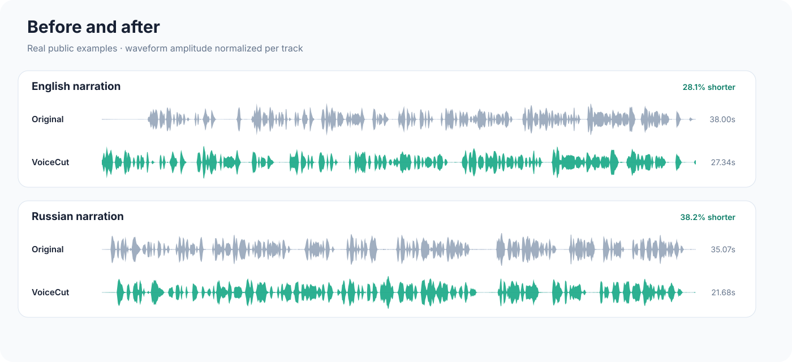
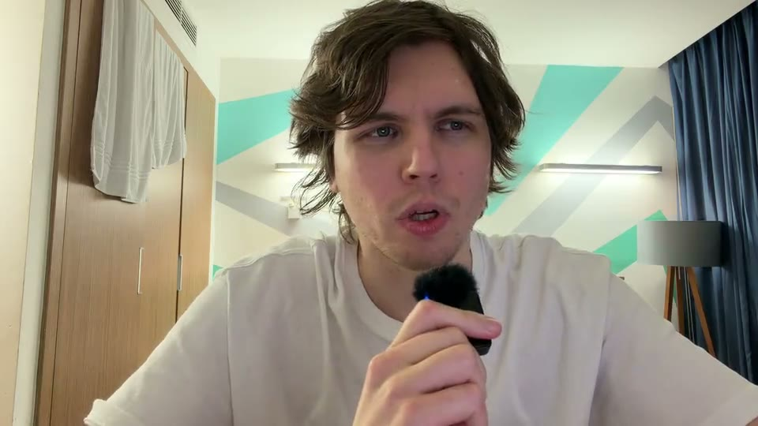
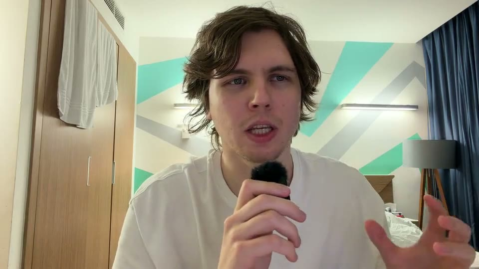
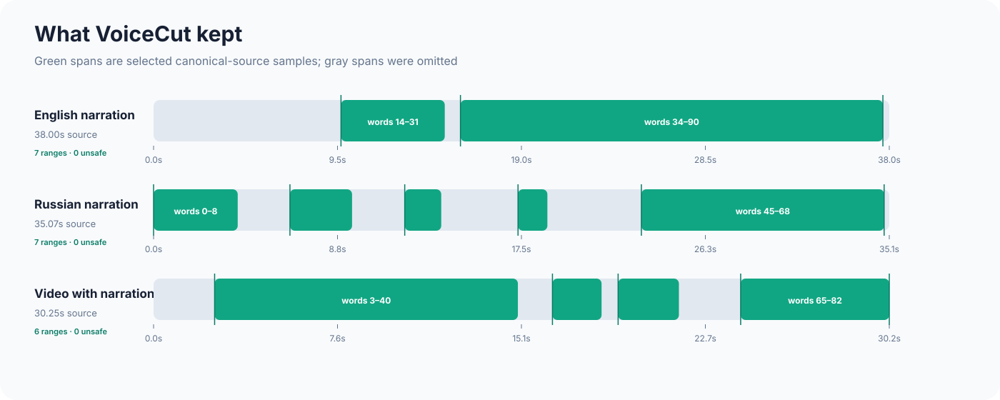

# VoiceCut examples

These are complete before/after examples produced by the real VoiceCut
pipeline. They are deliberately short enough to review directly on GitHub.
The originals contain retries, abandoned phrases, or pauses; the edited media
keeps the selected narration and uses phone-safe source boundaries.



## Results

| Example | Original | VoiceCut result | Duration | Reduction |
| --- | --- | --- | ---: | ---: |
| English narration | [Original WAV](media/audio/example_en.wav) | [Edited WAV](media/audio/example_en_edited.wav) | 38.00s → 27.34s | 28.1% |
| Russian narration | [Original WAV](media/audio/example_ru.wav) | [Edited WAV](media/audio/example_ru_edited.wav) | 35.07s → 21.68s | 38.2% |
| Video | [Original MP4](media/video/video.mp4) | [Edited MP4](media/video/video_edited.mp4) | 30.25s → 23.78s | 21.4% |

The percentages describe duration reduction, not a quality score. A cloud
planner may make a semantically equivalent selection on a later run, so a
fresh output does not need to be byte-identical to the frozen reference.

### Media provenance and privacy

The recordings were supplied by the VoiceCut project owner specifically for
this public demonstration. Avoidable authoring metadata was removed from the
published WAV containers without changing their decoded PCM samples. The
original mobile-camera MOV is not committed: `video.mp4` is a 960×540 H.264/AAC
transcode containing only the picture and narration tracks, with location,
device, and auxiliary sensor metadata removed.

## English audio

The English recording includes an abandoned opening and a repeated phrase.
VoiceCut keeps the later coherent take, grounds every narrated word in the
source, and renders the selected samples once.

```bash
./examples/run_examples.sh en
```

## Russian audio

The Russian example exercises Cyrillic grounding and Russian phone alignment,
including mixed-script terms such as `LLM` and `ONCE`.

```bash
./examples/run_examples.sh ru
```

## Video

Video editing follows the narration selection. The result keeps normal-speed
source frames and makes direct visual cuts; it does not add still frames to
imitate the semantic pauses used for audio-only narration.

| Original | VoiceCut result |
| --- | --- |
|  |  |

```bash
./examples/run_examples.sh video
```

## Reproduce all three

Install VoiceCut first, then put a non-empty Gemini key in the repository's
ignored `.env` file:

```dotenv
GEMINI_API_KEY=your-key-here
```

Run:

```bash
./examples/run_examples.sh all
```

The runner checks the key without printing it. It writes all derived outputs
and caches below `examples/generated/work`; committed reference media under
`examples/media` is read-only and is never overwritten.

## Provenance and visuals



[`demo_manifest.json`](demo_manifest.json) contains sanitized, repository-
relative provenance: media hashes, durations, codecs, planner details, source
word intervals, and the implementation fingerprint used for the reference
runs. It contains no API keys, raw model replies, private work directories, or
absolute developer paths.

Regenerate the README artwork from the checked-in media and manifest with:

```bash
python3 scripts/generate_readme_assets.py
```

The generator verifies every public-media hash and the current VoiceCut source
fingerprint before writing deterministic SVGs and video posters. It does not
invoke Gemini or rerun the editing pipeline.
